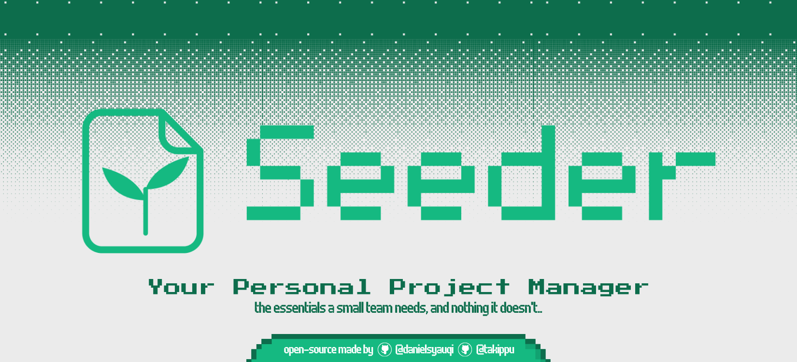
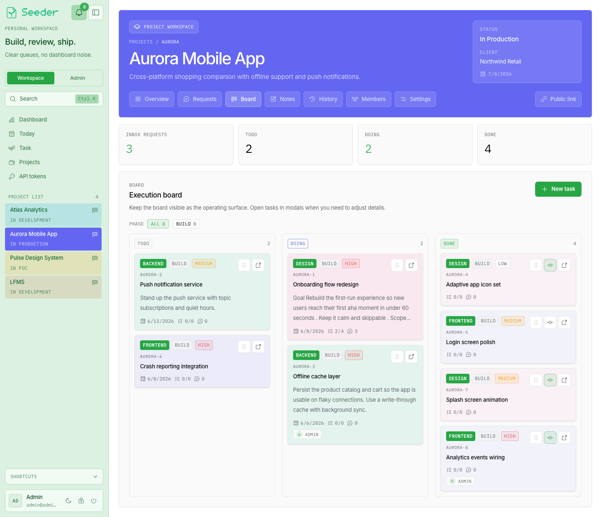
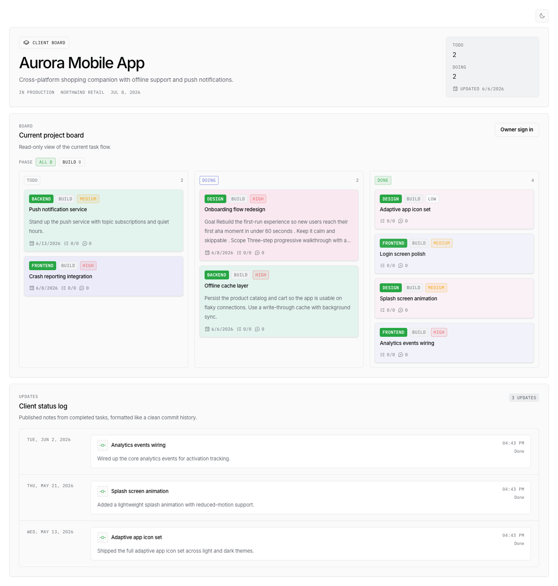
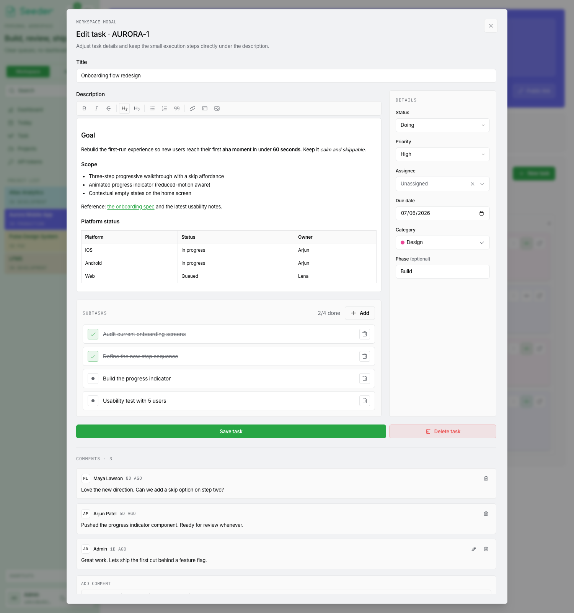

# Seeder: Your Personal Project Manager

[](https://github.com/danielsyauqi/Seeder/actions/workflows/ci.yml)
[](LICENSE)

A foundational project manager for small teams — simple to run, and yours to fork. Built with:

- `Next.js 16.2.4`
- `Cloudflare Workers` via `@opennextjs/cloudflare`
- `Cloudflare D1`
- `Cloudflare R2`
- `Drizzle ORM`
- `Better Auth`
- `Tailwind CSS`
- `dnd-kit`

## Philosophy

Project tools tend toward two extremes: the heavyweight complexity of Jira, or
lightweight boards like Trello that small teams outgrow in a month. Either way
you bend your work to fit the tool — and wait on someone else's roadmap for the
one feature you actually need.

This project takes the opposite stance:

- **Foundational, not heavy.** The essentials a small company needs to run
  projects, client requests, and day-to-day execution — productive immediately,
  with nothing to learn your way around.
- **Yours to fork.** It's open source. Customization isn't a feature request,
  it's a change to your own copy: add the field, view, or workflow your team
  needs without waiting on our updates, a plan upgrade, or any lock-in.
- **A small core, on purpose.** We keep the core minimal and solid so the rest
  is yours to build on.

Built for software teams first, but the foundation is deliberately general —
fork it, shape it, own it.

## Features

- **Projects & Kanban** — tasks with categories, phases, priorities, assignees,
  due dates, and per-project code numbers.
- **Client requests** — a separate inbound queue (new → reviewed → converted →
  closed) that can be converted into tasks.
- **Public client board** — an opt-in, token-gated read-only view to share
  progress with clients without giving them an account.
- **Daily planner** — an adhoc/project daily task queue with drag-to-reorder.
- **Rich text & comments** — TipTap-powered descriptions, notes, and comments
  with images and tables.
- **Activity feed** — every change is logged with before→after diffs, whether it
  comes from the UI or an AI assistant.
- **Notifications** — in-app notifications with read tracking.
- **Roles & invites** — owner/admin/member roles and invite-only onboarding with
  a first-owner bootstrap.
- **White-labeling** — customizable system name, logo, favicon, and accent color.
- **Built-in MCP server** — let AI assistants read and edit your data over the
  Model Context Protocol (see [MCP server](#mcp-server)).

## Screenshots

_Screenshots live in [`docs/images/`](docs/images/) — add yours and uncomment the
references below._

<!--



-->

## Prerequisites

- **Node.js 20+** and **npm** (CI runs on Node 24).
- A **Cloudflare account** is only needed to deploy — local development runs fully
  offline via Miniflare, no account required.

That's it — the seed/backfill scripts run via `tsx` (a dev dependency), so no
extra runtime is needed.

## Local setup

> **Fastest path — the setup wizard.** Run `npm install` then `npm run setup`. It
> walks you through one of three modes — **dev (local)**, **production (node)**
> (self-host on a VM: Node server + SQLite, no Cloudflare), or **production
> (cloudflare)** — generating the env, config, and (for node) the PM2/systemd/
> Docker + reverse-proxy artifacts. The manual steps below are the equivalent of
> the dev mode, if you'd rather do it by hand.

1. Install dependencies: `npm install`.
2. Copy `.dev.vars.example` to `.dev.vars` and fill in the values (each is
   documented inline in that file).
3. Apply migrations to the local D1: `npm run db:migrate:local`.
4. (Optional) Seed a local admin user — `admin@admin.com` / `admin`:
   `npm run db:seed:local`. Or skip it and create the owner via the one-time form
   at `/sign-in`, exactly as production does (see [Auth](#auth)).
5. Run `npm run dev` for Next.js local development.
6. Run `npm run preview` to test inside the Workers runtime.

Local D1 and R2 are simulated on disk by Miniflare (under `.wrangler/state`),
so no Cloudflare account is required for local development.

## Database

The app uses a D1 binding named `PM_DB`.

The initial D1 schema is checked in at `migrations/0001_initial.sql`.

Apply migrations locally:

```bash
npm run db:migrate:local
```

Apply migrations remotely:

```bash
npm run db:migrate:remote
```

For a self-hosted **node** instance (a local SQLite file via libSQL), apply
migrations with `npm run db:migrate:node`. See the [cheat sheet](#cheat-sheet)
for inspecting the database from a SQL client in any mode.

## Storage

Uploaded images (profile pictures, rich-text attachments) are stored in
Cloudflare R2 through the `UPLOADS` binding and served back via `/api/uploads/...`
(auth-gated, so objects are never publicly listable). The bucket name is set in
`wrangler.jsonc`. Locally, Miniflare keeps these objects under `.wrangler/state`.

In **node** mode the same routes serve from local disk instead, under `UPLOADS_DIR`
(default `./data/uploads`). See the [cheat sheet](#cheat-sheet) for reading R2
objects from the dashboard, `wrangler`, or an S3 client.

## Auth

Onboarding is **invite-only**, with a single bootstrap exception:

- **First owner.** On a brand-new instance (zero users), `/sign-in` shows a
  one-time "create owner account" form. Sign-up is permitted only for the
  configured `OWNER_EMAIL` (defaults to `admin@admin.com` when unset) and only
  while no users exist — once the owner account is created, public sign-up is
  closed for good. This gate is enforced server-side, not just in the UI.
- **Everyone else.** An owner or admin creates an invite from the **Invites**
  admin page and shares the link; the invitee sets their password through the
  invite flow. There is no open registration.
- **Google sign-in** appears automatically when the OAuth env vars are present,
  and only signs into already-provisioned accounts (no self-provisioning).
  On the Google OAuth client, register
  `<BETTER_AUTH_URL>/api/auth/callback/google` under **Authorized redirect
  URIs** — the match is exact (scheme, host, full path, no trailing slash) and
  the "JavaScript origins" field doesn't count, otherwise Google rejects the
  flow with `Error 400: redirect_uri_mismatch`.
- **Multiple hostnames.** Auth requests are origin-checked against
  `BETTER_AUTH_URL` (the canonical base URL) plus `localhost`. If the app is
  reachable at more than one hostname — e.g. both a `*.workers.dev` URL and a
  custom domain — list the extras in `BETTER_AUTH_TRUSTED_ORIGINS`
  (comma-separated) so sign-in isn't rejected with `Invalid origin`.

## MCP server

Seeder ships a built-in [Model Context Protocol](https://modelcontextprotocol.io)
server at **`/api/mcp`**, so AI assistants (Claude, Cursor, ChatGPT, …) can read
and edit your projects, tasks, requests, and subtasks. It deploys with the app —
every self-hosted instance gets it for free at `https://<your-domain>/api/mcp`.

**Connect a client:**

1. In the app, open **Settings → API tokens** and create a token. Pick **read**
   (query only) or **read & write** (also create/update/delete). The token is
   shown once — copy it.
2. Point your MCP client at the endpoint with the token as a bearer header:

   ```json
   {
     "mcpServers": {
       "seeder": {
         "url": "https://<your-domain>/api/mcp",
         "headers": { "Authorization": "Bearer seed_pat_…" }
       }
     }
   }
   ```

A token can never do more than the user who created it — every tool runs under
that user's existing project access, and write tools only appear for `read & write`
tokens. All MCP-driven changes show in the project Activity feed, attributed to
the token's user, exactly like changes made in the UI.

**Tools:** `whoami`, `list-projects`, `list-tasks`, `read-task`, `list-requests`,
`read-request`, `search`, `list-daily-tasks`, `read-project-notes`,
`list-project-activity`, `list-status-updates` (read); `create/update/delete-task`,
`update-task-status`, `create/toggle/update/delete-checklist-item`,
`create/update/delete-request` (read & write). Project and daily-task write tools
are planned.

**Hardening:** set `MCP_ALLOWED_ORIGINS` (comma-separated) to restrict which
browser origins may call `/api/mcp` (DNS-rebinding protection). It's optional —
the endpoint always requires a token — but recommended in production. Clients
that can't speak remote MCP can bridge with
[`mcp-remote`](https://www.npmjs.com/package/mcp-remote).

For the full architecture and engineering reference, see [docs/MCP.md](docs/MCP.md).

## Deploy

> **Two targets, one wizard.** `npm run setup` configures either **Cloudflare
> Workers** (mode 3, the steps below) or a **self-hosted Node server** (mode 2 —
> a standalone `next start` on a local SQLite file + disk uploads, no Cloudflare
> dependency, kept alive by PM2/systemd/Docker). See
> [docs/ARCHITECTURE.md](docs/ARCHITECTURE.md#7-deployment) for the trade-offs
> between them.

Runs on Cloudflare Workers (via OpenNext). Before the first deploy:

1. Create the D1 database and copy its id into `wrangler.jsonc`
   (`database_id` / `preview_database_id`):

   ```bash
   npx wrangler d1 create seeder
   ```

2. Create the R2 bucket for uploads — its name must match `bucket_name` in
   `wrangler.jsonc`:

   ```bash
   npx wrangler r2 bucket create seeder-uploads
   ```

3. Provide the runtime config (`OWNER_EMAIL`, `BETTER_AUTH_URL`, and the
   `BETTER_AUTH_SECRET`). `BETTER_AUTH_SECRET` should be a secret; the others can
   be Worker vars:

   ```bash
   npx wrangler secret put BETTER_AUTH_SECRET
   ```

4. Apply migrations remotely: `npm run db:migrate:remote`.
5. Deploy: `npm run deploy`.
6. **Create the first owner.** Visit `https://<your-domain>/sign-in` and use the
   one-time "create owner account" form. It only accepts the `OWNER_EMAIL` you
   configured, and only while the instance has no users. Afterwards, invite the
   rest of your team from the **Invites** page — public sign-up stays closed.

## Cheat sheet

Quick reference for day-to-day development and self-hosting. The `RUNTIME` env var
(`cloudflare` default | `node`) selects the runtime — `npm run setup` sets it for you.

### Commands

```bash
# Setup
npm install
npm run setup            # interactive wizard: dev / production node / cloudflare

# Develop (Miniflare — local D1 + R2, no Cloudflare account)
npm run dev              # Next.js dev server (webpack)
npm run preview          # build + run the real Worker bundle locally

# Quality gates (what CI runs)
npm run lint
npx tsc --noEmit
npm test                 # vitest

# Migrations
npm run db:migrate:local   # → local Miniflare D1   (dev)
npm run db:migrate:remote  # → deployed Cloudflare D1
npm run db:migrate:node    # → local SQLite file    (node mode, SQLITE_DB_PATH)

# Seed (runs via tsx, no Bun) — :local → Miniflare D1, :node → the SQLite file
npm run db:seed:local        # owner: admin@admin.com / admin
npm run db:seed:demo:local   # demo projects / tasks / requests
npm run db:seed:node         # same owner, into the node-mode SQLite file
npm run db:seed:demo:node    # same demo workspace, into the node-mode SQLite file

# Self-host on a VM (node mode)
npm run build:node
npm run start:node           # kept alive by the generated PM2/systemd/Docker artifact

# Deploy to Cloudflare
npm run deploy
```

### Inspect the database

- **Dev (Miniflare D1)** — it's a real SQLite file on disk:
  - Quick SQL: `npx wrangler d1 execute PM_DB --local --command "SELECT email, role FROM user"`
  - GUI: open `.wrangler/state/v3/d1/miniflare-D1DatabaseObject/*.sqlite` in
    DBeaver, TablePlus, or DB Browser for SQLite.
- **Node mode** — open the file at `SQLITE_DB_PATH` (default `./data/seeder.db`)
  in any SQLite tool, or `sqlite3 ./data/seeder.db`.
- **Remote (Cloudflare D1)** —
  `npx wrangler d1 execute PM_DB --remote --command "SELECT count(*) FROM user"`,
  or the **D1 → Console** in the Cloudflare dashboard. (D1 has no host/port, so
  traditional clients like DBeaver can't connect remotely — use wrangler/dashboard.)

### Access uploads (R2 / disk)

- **Dev (Miniflare R2)** —
  `npx wrangler r2 object get seeder-uploads/<key> --local` (also `put` / `delete`);
  the simplest path is through the app at `/api/uploads/...` (auth-gated).
- **Node mode** — plain files under `UPLOADS_DIR` (default `./data/uploads`); just
  `ls` / open them.
- **Remote (Cloudflare R2)** —
  - Cloudflare dashboard → **R2** → bucket browser (list / upload / download).
  - `npx wrangler r2 object get seeder-uploads/<key> --remote`
  - Any **S3 client** (`rclone`, Cyberduck, `aws s3`) — R2 is S3-compatible; create
    an access key under **R2 → Manage R2 API Tokens** and point it at the R2 endpoint.

### Seed data for dev testing

`npm run db:seed:local` gives you an owner you can sign in with immediately
(`admin@admin.com` / `admin`); `npm run db:seed:demo:local` adds a demo workspace
(projects, tasks, requests, daily items, teammates) on top. They run via `tsx`
(no Bun needed), target the **local Miniflare D1**, and assume migrations have been
applied. For a self-hosted **node** instance, the `:node` variants
(`db:seed:node`, `db:seed:demo:node`) write the same data into the SQLite file at
`SQLITE_DB_PATH` — run `npm run db:migrate:node` first.

## App structure

- `/sign-in`
- `/projects`
- `/projects/[projectId]`

Each project workspace includes:

- `Client Requests`
- `Kanban Tasks`
- `Project Notes`

## Support

Need a hand, hit a bug, or have an idea for an improvement? Open an issue on
[GitHub](https://github.com/danielsyauqi/Seeder/issues), or email us at
[seeder.admin@gmail.com](mailto:seeder.admin@gmail.com).

## Contributing

Contributions are welcome! See [CONTRIBUTING.md](CONTRIBUTING.md) for local setup,
the pre-PR checks (lint, type-check, tests, build), and conventions — CI runs the
same gates on every pull request.

## Security

Please report vulnerabilities privately via the process in
[SECURITY.md](SECURITY.md). Don't open public issues for security problems.

## Acknowledgements

A massive thank you to **Thaqif Rosdi ([@takippu](https://github.com/takippu))** —
Seeder grew out of his original idea, first built as **northstar-pm**, and it
wouldn't exist without it. 🙏

## License

[MIT](LICENSE) © 2026 Daniel Syauqi ([@danielsyauqi](https://github.com/danielsyauqi)) and Thaqif Rosdi ([@takippu](https://github.com/takippu))

The code is free to use, fork, and modify under MIT — just keep the copyright
notice and license intact (see [NOTICE](NOTICE)). The **Seeder name and logo**
are trademarks and are not covered by the MIT License: you can fork the code,
but not the brand. See [TRADEMARK.md](TRADEMARK.md).

---

Made by [@danielsyauqi](https://github.com/danielsyauqi) and [@takippu](https://github.com/takippu).
